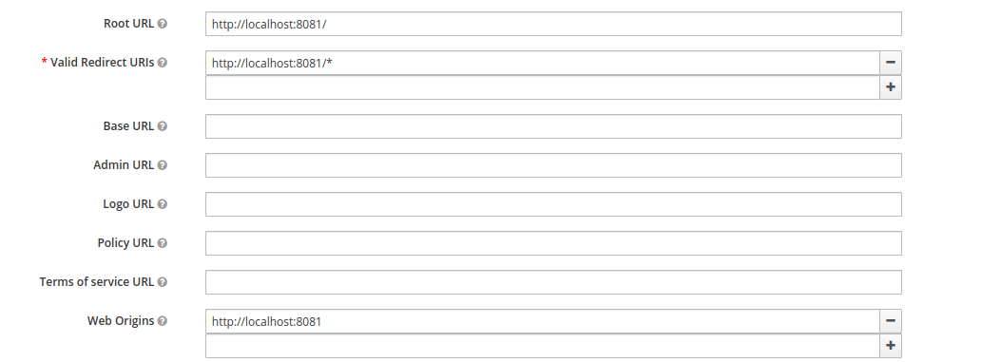

# Welcome to ATP

### Keycloak Documentation

1. Create Public and private client in keycloak
#### Public client

#### Private client

2. Fire API for adding group info to CACHE
   "/api/app/admin/group/cache"

3. Fire API for creating all API roles into keycloak private client 
   "/api/app/admin/role/keycloak"
4.Create Groups manually in keycloak and assign relevent role to group
5. Add Group Mapper
   Client Scopes -> roles -> Mapper -> CREATE NEW 
   Name := group
   Mapper Type := Group Membership
   Token Claim Name := group_name (Same as backend Application)
   Enable Add to Access Token 
6. Manually Assign Group to users to allow specific Group